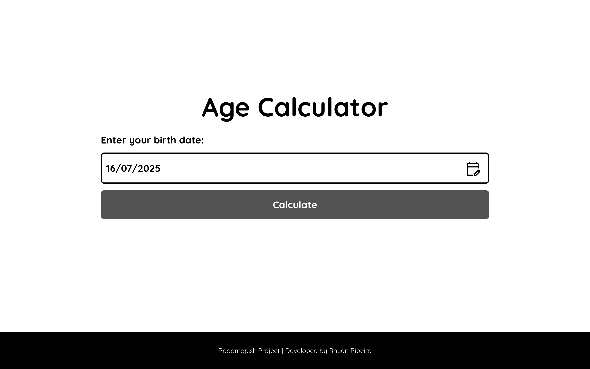

# Age Calculator (Vite + JavaScript + Luxon)

An age calculator built with **Vite**, **JavaScript**, **HTML**, and **CSS**.  
This project was created as part of a [roadmap.sh](https://roadmap.sh) exercise to practice how to use **external packages via NPM**.

Users can enter their date of birth using the **JavaScript Datepicker**, and the app calculates and displays their exact age in **years, months, and days**, using the **Luxon** library for precise date handling.

[🔗 View the live project](https://rhuan-ribeiro.github.io/age-calculator/)

---

## 🔧 Technologies Used

- Vite (frontend build tool)
- HTML5
- CSS3 (with responsive layout)
- Modern JavaScript (ES6+)
- [Luxon](https://moment.github.io/luxon/#/) (date manipulation)
- [js-datepicker](https://www.npmjs.com/package/js-datepicker) (calendar date picker)
- NPM (package manager)

---

## 💡 What I Learned

- Setting up and using **Vite** for modern frontend development
- Installing and integrating **external packages** with NPM
- Calculating accurate age differences with **Luxon**
- Using and styling the **js-datepicker** component
- Deploying a Vite project on **GitHub Pages**

---

## 📸 Screenshots

### 💻 Desktop view


### 📱 Mobile view


---

## ▶️ How to Run the Project Locally

To run this project on your local machine:

1. **Clone the repository:**

```bash
git clone https://github.com/Rhuan-Ribeiro/age-calculator.git
```

2. **Navigate into the project folder:**

```bash
cd age-calculator
```

3. **Install the dependencies:**

```bash
npm install
```

4. **Start the development server:**

```bash
npm run dev
```

---

## 🙏 Credits

This project is based on the [Age Calculator project from roadmap.sh](https://roadmap.sh/projects/age-calculator).

It was created to strengthen my knowledge of using external libraries with NPM and performing accurate date calculations with Luxon.